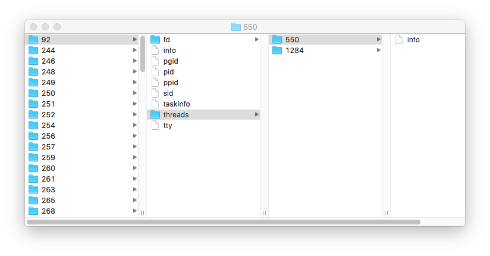
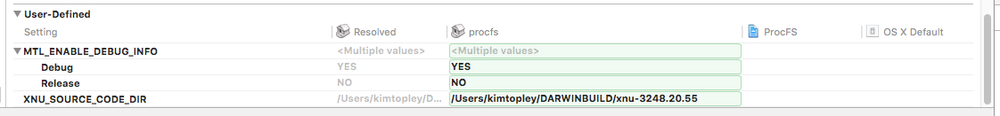

# ProcFS
An implementation of the /proc file system for OS X

## What is procfs?
*procfs* lets you view the processes running on a UNIX system as nodes in the file system, where each process is represented by a single directory named from its process id. Typically, the file system is mounted at `/proc`, so the directory for process 1 would be called `/proc/1`. Beneath a process’ directory are further directories and files that give more information about the process, such as its process id, its active threads, the files that it has open, and so on. *procfs* first appeared in an early version of AT&T’s UNIX and was later implemented in various forms in System V, BSD, Solaris and Linux. You can find a history of the implementation of *procfs* at https://en.wikipedia.org/wiki/Procfs.

In addition to letting you visualize running processes, *procfs* also allows some measure of control over them, at least to suitably privileged users. By writing specific data structures to certain files, you could do such things as set breakpoints and read and write process memory and registers. In fact, on some systems, this was how debugging facilities were provided. However, more modern operating systems do this differently, so some UNIX variants no longer include an implementation of *procfs*. In particular, OS X doesn’t provide *procfs* so, although it’s not strictly needed, I thought that implementing it would be an interesting side project. The code in this repository provides a very basic implementation of *procfs* for OS X. You can use it to see what processes and threads are running on the system and what files they have open. Later, I plan to add more features, neginning with the ability to inspect a thread’s address space to see which executable it is running and what shared libraries it has loaded. 

If you install *procfs* on your system, mount it at `/proc` and take a look at it with Finder, you’ll see a hierarchy of files that looks something like this:



Each directory in the left column represents one process on the system. By default you can only see your own processes, although it is possible to set an option when mounting the file system that will let you see and get details for every process. Obviously this is a security risk, so it’s not the default mode of operation. Within each process directory are seven files and two further directories, shown in the second column of the screenshot. All of the files can be read in the normal way, but the data that they contain is not text, so they are really intended to be used in applications rather than for direct human consumption. The following table summarizes what’s in each file. You’ll find definitions of the structures in this table in the file */usr/include/sys/proc_info.h*.

| File    | Summary                          | Structure                     |
|---------|----------------------------------|-------------------------------|
|`pid`    | Process id                       | `pid_t`                         |
|`ppid`     | Parent process id                | `pid_t`                         |
|`pgid`     | Process group id                 | `pid_t`                         |
|`sid`      | Session id                       | `pid_t`                         |
|`tty`      | Controlling tty                  | string, such as `/dev/tty000` |
|`info`     | Basic process info               | `struct proc_bsdinfo`           |
|`taskinfo` | Info for the process’s Mach task | `struct proc_taskinfo`          |

The `fd` directory contains one entry for each file that the process has open. Each entry is a directory that’s numbered for the corresponding file descriptor. Most processes will have at least entries 0, 1 and 2 for standard input, output and error respectively. Within each subdirectory you’ll find two files called `details` and `socket`. The `details` file contains a `vnode_fdinfowithpath` structure, which contains information about the file including its path name if it is a file system file. If the file is a socket endpoint, you can read a `socket_fdinfo` structure from the `socket` file.

The `threads` directory contains a subdirectory for each of the process’ threads. The process in the screenshot above has two threads with ids 550 and 1284. Each thread directory contains a single file called `info` the contains thread-specific information in the form of a `proc_threadinfo` structure.

## Using procfs for OS X

To use procfs, you'll have to build your own copy of the OS X kernel. Booting a new kernel on your own hardware is a risky process, so I recommend that you start by getting a second disk and installing OS X on it. Instead of installing your kernel on your main disk, you'll put it on your second drive and boot from that for testing. If anything goes wrong, you can always get a working system back by rebooting from your primary disk. I also recommend that you use two OS X systems--one on which you run the development kernel (the target system) and another on which you build the kernel (the development system). You'll need to do this if you want to debug any problems with your kernel.

### Building and Booting a Kernel

To get started, download a copy of the kernel sources from http://www.opensource.apple.com. procfs was developed with OS X version 10.11.2. Follow the link from the main opensource page to see all of the available source code for that version and locate the **xnu** subproject (the current release is called **xnu-3248.20.55**). Click on the arrow icon to download a tarball and extract the source code to your development machine. 

Next, you'll need to get the tools required to build the kernel and procfs. You'll need Xcode (I used version 7.2) and the command line tools, both of which you can get from https://developer.apple.com/downloads. While you're there, get the Kernel Debug Kit as well, making sure that you get the correct version for the release of OS X that you're developing on. You need to be sure that the versions of the kernel source code and the Kernel Debug Kit are the same and you'll need to have that version of OS X running on both your target and development machines. Install Xcode, the command line tools and Kernel Debug Kit on your development machine.

Building the kernel is surprisingly easy if you have all of the prerequisites installed. You can find a complete set of instructions for this at http://shantonu.blogspot.com. Look for the article called "Building xnu for OS X 10.11 El Capitan". procfs does not add any new system calls, so you don't need to be concerned about the section that describes how to do that, so once you've built your kernel, skip paragraphs 1 through 4 in that section and proceed to section 5. You'll need to disable system integrity protection to install a new kernel. To do that, boot your target system into recovery mode by restarting and holding down the Option key when you hear the chime, then open a terminal window and enter the command "csrutil disable". You'll also need to set NVRAM boot arguments, which you can do by entering the following command:

````
sudo nvram boot-args="-v debug=0x146 kdp_match_name=enX"
````

Take note of the last part of that line-the device name that appear after `kdp_match_name` is the device that you'll use to connect to the target system for debugging. You can read about how to set up 2-machine debugging in the README file of the Kernel Debug Kit. In my case, the machines I use for debugging are connected over Ethernet and the name of the Ethernet connector on the target machine is `en3`, so my NVRAM boot arguments are set up like this:
````
sudo nvram boot-args="-v debug=0x146 kdp_match_name=en3"
````

Now reboot the target machine using its primary disk. When you do that, you'll see one result of setting boot arguments--for most of the boot process, you'll be looking at console messages instead of the usual graphical user interface. If something goes wrong while booting, you're very likely to see something here that will help you figure out what the problem is. If you value the integrity of your system, you'll install the kernel in on /System/Library/Kernels on your second disk. To do that, plug it in so that it appears as /Volumes/Something, backup your existing kernel, copy the new kernel to /Volumes/Something/System/Library/Kernels and then use the command "sudo kextcache -invalidate /Volumes/Something" to rebuild the kernel extension cache. Note that you need to do this every time you install a new kernel, before you reboot. 

You're finally ready to try your new kernel. Reboot the target maching, hold down the Option key and select to boot from your second drive. If all goes well, OS X should start up as normal and will be running your new kernel. You can check that it's your kernel by typing the command `uname -a`. For Apple's release kernel, you'll see something like this:

````
Darwin Kims-iMac.local 15.2.0 Darwin Kernel Version 15.2.0: Fri Nov 13 19:56:56 PST 2015; root:xnu-3248.20.55~2/RELEASE_X86_64 x86_64
````

If you are running your own kernel, the date and time should match those of your build and your login name should appear instead of `root`.

### Building a Kernel with procfs

Now that you can build and boot your own kernel, you can add procfs to it. Download the source code from the GitHub repository (https://github.com/kimtopley/ProcFS) and open the project file at `ProcFS/ProcFS.xcodeproj` in Xcode. You'll see that the project has three targets:

1. The `mount_procfs` target builds the `mount` command that's required to mount the *procfs* file system.
2. The `procfs` target contains the kernel source code. The project is set up to allow the code to be built with the same options and header files that are available during a kernel build, so that editing can be done in Xcode. The code can be compiled and will produce a static library, but the code produced in Xcode is not used in the kernel--you need to do a separate kernel build for testing. Note that the code won't compile until you've made a configuration change that's described below.
3. The `Tests` target holds the source code for the unit tests. See the section on Testing for more about this.

Before you can make any progress, you need to make some changes to the Xcode project and to your kernel source code to allow *procfs* to be included in a kernel build. 

In Xcode, select `ProcFS` at the top of the Project Navigator, then select `procfs` under `TARGETS` in the main editor area. In the menu, select `Editor > Add Build Setting > Add User-Defined Setting`. If this option is not enabled, reselect the target and try again. Add a setting called **XNU_SOURCE_CODE_DIR** and set its value to the path name of the directory into which you expanded the kernel source code. In my case, the kernel source tree is at `/Users/kimtopley/DARWINBUILD/xnu-3248.20.55`, so my setting looks like this:



Once you've done that, you should be able to select any of the three targets in the Scheme selector in Xcode and build them successfully. If you can't get the `procfs` target to build, most likely either the value of the **XNU_SOURCE_CODE_DIR** setting is incorrect, or you haven't done a full build in the kernel source tree.

Now you need to make some changes to the kernel source. Note that if you later download a new version of the kernel sources, you'll need to change the **XNU_SOURCE_CODE_DIR** setting in Xcode and make all of these changes again. Note also that it's not guaranteed that the currect *procfs* source will work with future versions of the operating system source. If Apple makes changes that break *procfs*, I'll endeavor to fix the problem as soon as I find out about it.

In the kernel source tree, open the file `bsd/conf/files` and add the following lines at the end:

````
bsd/miscfs/procfs/procfs_vfsops.c	optional procfs
bsd/miscfs/procfs/procfs_vnops.c	optional procfs
bsd/miscfs/procfs/procfsnode.c		optional procfs
bsd/miscfs/procfs/procfsstructure.c	optional procfs
bsd/miscfs/procfs/procfs_data.c		optional procfs
bsd/miscfs/procfs/procfs_subr.c		optional procfs
````

Edit the file `config/MASTER` and add the following lines at the end:

````
#
# procfs file system.
#
options		PROCFS	
````

Next, open the file `bsd/vfs/vfs_conf.c`. We need to add code in here to make the *procfs* file system available. Several sections of the file are affected.
First, add the lines shown in bold below after the section dealing with `MOCKFS`:

````
\#if MOCKFS
extern	struct vfsops mockfs_vfsops;
extern	int mockfs_mountroot(mount_t, vnode_t, vfs_context_t);
\#endif /* MOCKFS */

**\#if PROCFS**
**extern struct vfsops procfs_vfsops;**
**\#endif /* PROCFS */**
````

Next, add a new case to the `fs_type_num` enumeration:
````
enum fs_type_num {
    FT_NFS = 2,
    FT_HFS = 17,
    FT_DEVFS = 19,
    FT_SYNTHFS = 20,
**\#if PROCFS**	
**    FT_PROCFS = 21,**
**\#endif /* PROCFS */**
    FT_MOCKFS  = 0x6D6F636B
};
````
Add a *procfs* entry to the `vfstable` structure, just above the one for `MOCKFS`:
````

**\#if PROCFS**
**{ &procfs_vfsops, "procfs", FT_PROCFS, 0, 0, NULL, NULL, 0, 0, VFC_VFS64BITREADY | VFC_VFSNOMACLABEL, NULL, 0, NULL},**
**\#endif /* PROCFS */**

#if MOCKFS
/* If we are configured for it, mockfs should always be the last standard entry (and thus the last FS we attempt mountroot with) */
{ &mockfs_vfsops, "mockfs", FT_MOCKFS, 0, MNT_LOCAL, mockfs_mountroot, NULL, 0, 0, VFC_VFSGENERICARGS, NULL, 0, NULL},
#endif /* MOCKFS */

````
Add the following declaration below a similar one for `MOCKFS`:
````
\#if MOCKFS
extern struct vnodeopv_desc mockfs_vnodeop_opv_desc;
\#endif /* MOCKFS */

**\#if PROCFS**
**extern struct vnodeopv_desc procfs_vnodeop_opv_desc;**
\#endif /* PROCFS */**
````
and finally add the following at the end of the initialize for the `vfs_opv_descs` array:
````
**\#if PROCFS**
**&procfs_vnodeop_opv_desc,**
**\#endif /* PROCFS */**

#if MOCKFS
&mockfs_vnodeop_opv_desc,
#endif /* MOCKFS */

````

The final step is to add the *procfs* file system source code to the kernel source tree. Instead of copying it, create
a symbolic link from the kernel tree to the source that you see in Xcode:
````
cd bsd/miscfs
ln -s <CODE_LOCATION>/ProcFS/procfs procfs
````
where <CODE_LOCATION> is the full path prefix for the location where you downloaded the source code from this repository. 
If you have added the symbolic link correctly, you should be able to `cd procfs` to set your working directory to the
location of the *procfs* source code and you should see files named `procfs.h`, `procfs_data.c` etc.

You should now be able to rebuild your kernel with *procfs* included.

### Installing and Using procfs

After building *procfs*, you need to install the new kernel on your target system and invalidate the kernel extension cache. You also need to copy the `mount_procfs` executable from the Xcode project to `/sbin/mount_procfs` on your target system. Make sure it has permissions 0755, owner *root* and group *wheel*. Note that you only need to do this step once, even if you have to replace the kernel. Once you've done that, reboot your system. To use *procfs*, you need to mount it, like this:
````
sudo mkdir /proc
sudo mount -t procfs proc /proc
````
You can check that the file system is mounted by using the `mount` command. To unmount *procfs*, do this:

````
sudo umount /proc
````

## Why isn’t procfs a Kernel Extension?

For the first few weeks of development, *procfs* was implemented as a kernel extension. Developing a kernel extensions is much easier than adding code to the kernel itself because an extension can be installed, loaded for testing, unloaded and then replaced without rebooting—provided, of course, that the extension doesn’t cause a kernel panic or a lock up. I used this mode of operation to get the file system to the point where it would mount and do basic things, such as resolve path names and read directory data. The problem with being in a kernel extension is that you only have access to a small and tightly controlled API. For most of what *procfs* does, this API just isn't sufficient. For example, kernel extensions can't examine a process's `proc` structure or discover what threads a process has. For that and many other things that *procfs* needs access to, it has to be part of the kernel itself.

## Testing the procfs Implementation

*procfs* has a suite of tests implemented in GoogleTest. To run them, select the `Tests` target in Xcode and build it, then copy the *Tests* binary to the system on which you are running *procfs*. Make sure the file system is mounted on `/proc` and then run the tests by invoking the executable:
````
./Tests
````

# Terms Of Use 

I hope that this software is useful and/or interesting to someone other than myself.
If you choose to use it, please be aware that it is free software. You can redistribute it and/or
modify your copy of it as you see fit. It is provided WITHOUT ANY WARRANTY; without even the implied warranty of
MERCHANTABILITY or FITNESS FOR A PARTICULAR PURPOSE. In other words, caveat emptor.

# Problems and Feedback

Send all bug reports and other feedback to kimtopley@gmail.com.
